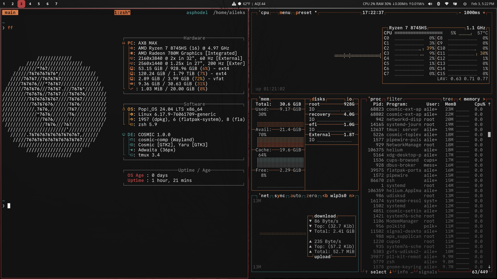

# Linux Dotfiles



## Features

- **Desktop**: COSMIC
- **Terminal**: WezTerm
- **Shell**: Zsh
- **Editor**: [Emacs](https://codeberg.org/aileks/emacs.d)
- **PDF viewer**: Zathura
- **Media player**: mpv

## Quick Start

```bash
curl -fsSL https://aileks.dev/linux | bash
```

Or manually:

```bash
git clone https://codeberg.org/aileks/dotfiles.git ~/.dotfiles
cd ~/.dotfiles
./setup.sh
```

## Install Script Flags

```bash
./install.sh              # Interactive menu
./install.sh 1            # Full setup (symlinks + build)
./install.sh 2            # Symlink only
./install.sh --dry-run 1  # Preview changes
```

## Resources

- [COSMIC](https://github.com/pop-os/cosmic-epoch)
- [keyd](https://github.com/rvaiya/keyd)
- [Helium](https://github.com/imputnet/helium-linux)

## License

[MIT](./LICENSE)
