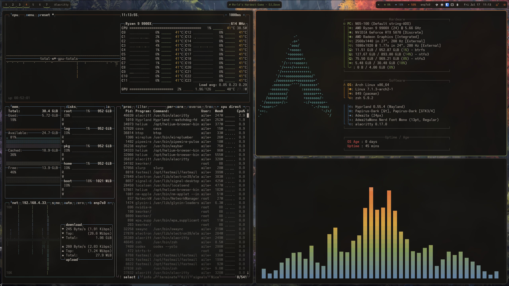

# Arch Hyprland dotfiles

Opinionated Arch desktop built around Hyprland with UWSM.



## Install

```bash
curl -fsSL https://aileks.dev/linux | bash
```

Or clone directly:

```bash
git clone https://codeberg.org/aileks/dotfiles.git ~/.dotfiles
cd ~/.dotfiles
./setup.sh
```

## Keybinds

| Key | Action |
| --- | --- |
| Super + Space | Launcher |
| Super + Return | Alacritty |
| Super + W | Web Browser |
| Super + E | File Manager |
| Super + M | Mail application |
| Super + S | Signal Desktop |
| Super + I | Desktop settings menu, including `nwg-look` |
| Super + Q | Close |
| Super + F | Fullscreen |
| Super + Shift + Space | Float |
| Super + H/J/K/L | Focus window |
| Super + Shift + H/J/K/L | Move window |
| Super + Ctrl + H/J/K/L | Resize window |
| Super + 1-8 | Select workspace |
| Super + Shift + 1-8 | Move window to workspace |
| Super + , / . | Select monitor |
| Super + Shift + , / . | Move window to monitor |
| Super + V | Clipboard history |
| Super + N | Notification center |
| Super + Shift + / | Keybind help |
| Super + Escape | Lock |
| Super + Shift + P | Power menu |
| Print / Shift + Print | Region / full screenshot |

## tmux

Prefix: `Ctrl + Space`

| Key | Action |
| --- | --- |
| Prefix + `o` | Open project session |
| Prefix + `s` | Switch session |
| Prefix + `w` | Switch window |
| Prefix + `-` / `\|` | Split vertically / horizontally |
| Prefix + `v` | Enter copy mode |
| Copy mode `v` / `y` | Select / copy to Wayland clipboard |
