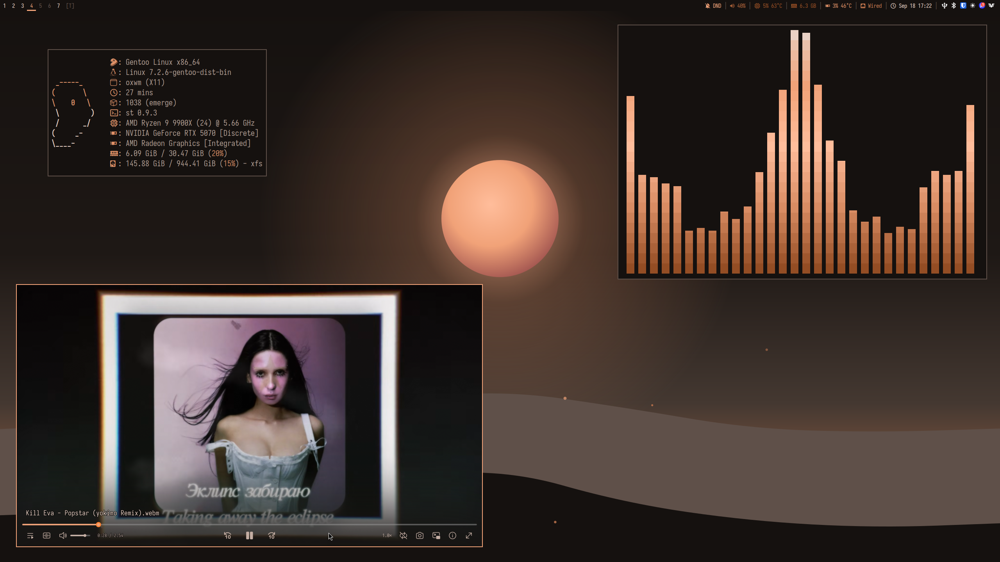

# dotfiles

Void Linux post-install script and dotfiles for my setup.



_The wallpaper is built from an SVG._

## Install

```sh
git clone --recurse-submodules https://github.com/aileks/dotfiles.git ~/.dotfiles
cd ~/.dotfiles
./install.sh
```
