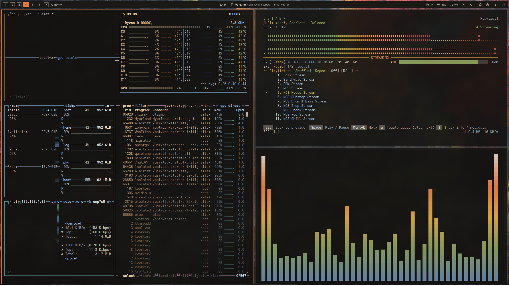

# Omarchy dotfiles

Personal desktop layered on top of [Omarchy](https://omarchy.org/) (Arch Linux
+ Hyprland). Omarchy stays the upstream layer — nothing under
`/usr/share/omarchy/` is modified — and this repository holds only the
override files, linked into `~/.config`.



## Layout

| Repo path                          | Live location                            | Purpose                                                       |
| ---------------------------------- | ---------------------------------------- | ------------------------------------------------------------- |
| `hypr/`                            | `~/.config/hypr` (dir symlink)           | Hyprland override layer: monitors, keybind merge, input, look  |
| `omarchy/shell.toml`               | `~/.config/omarchy/shell.toml`           | Bar font size                                                 |
| `omarchy/shell.json`               | `~/.config/omarchy/shell.json`           | Bar layout (default layout, battery plugin disabled)          |
| `omarchy/themes/cinder-grove/`     | `~/.config/omarchy/themes/cinder-grove`  | Custom Cinder Grove theme (colors, GTK, icons, backgrounds)   |
| `alacritty/`, `nvim/`, `tmux/`, …  | `~/.config/...`                          | Terminal, editor, and CLI configs                             |
| `uwsm/`                            | `~/.config/uwsm`                         | Session env: Nvidia, Bitwarden SSH agent                      |
| `bin/doctor`                       | `~/.local/bin/doctor`                    | Postflight checks for the layer above                         |
| `setup.sh`                         | —                                        | Omarchy post-install (apps, links, personal system bits)      |

### Hyprland override layer

`hypr/hyprland.lua` is Omarchy's template: it loads Omarchy's defaults first,
then the personal files, so package updates improve the defaults without
rewriting them.

- `monitors.lua` — DP-1 (primary, `0x0`) and HDMI-A-1 (portrait, left), with
  workspaces 1–7 pinned to DP-1 and 8 to HDMI-A-1, all persistent.
- `bindings.lua` — a minimal merge: SUPER+hjkl focus and SUPER+Shift+hjkl move
  replace Omarchy's arrow navigation (SUPER+j/k/l unbound first), and the
  workspace 9/0 bindings are dropped for exactly eight workspaces. Everything
  else Omarchy binds is untouched; see `omarchy menu keybindings --print`.
- `input.lua` — xkb caps↔ctrl keymap (`keymap.xkb`) and repeat/mouse prefs.
- `looknfeel.lua` — group bar font size 14; the rest follows the active theme.

## Install

On a fresh Omarchy install:

```bash
git clone https://github.com/aileks/dotfiles.git ~/.dotfiles
cd ~/.dotfiles
./setup.sh
```

Preview everything without making changes with `./setup.sh --dry-run`. The
script installs personal apps with `yay -S --needed` (Omarchy's package
helper), links the config layer, retires the pre-Omarchy desktop stack, and
sets up mDNS, DDC/CI brightness access, Zsh, tmux-sessionizer, and nvm.

The Cinder Grove theme is applied with `omarchy theme set cinder-grove` after
linking (already done on this machine).

## Keybinds

Omarchy defaults apply everywhere else (launcher, terminal, media keys,
screenshots, clipboard, menus — see `omarchy menu keybindings --print`), plus:

| Key                              | Action                          |
| -------------------------------- | ------------------------------- |
| Super + `h`/`j`/`k`/`l`          | Focus window                    |
| Super + Shift + `h`/`j`/`k`/`l`  | Move window                     |
| Super + 1-8                      | Select workspace                |
| Super + Shift + 1-8              | Move window to workspace        |
